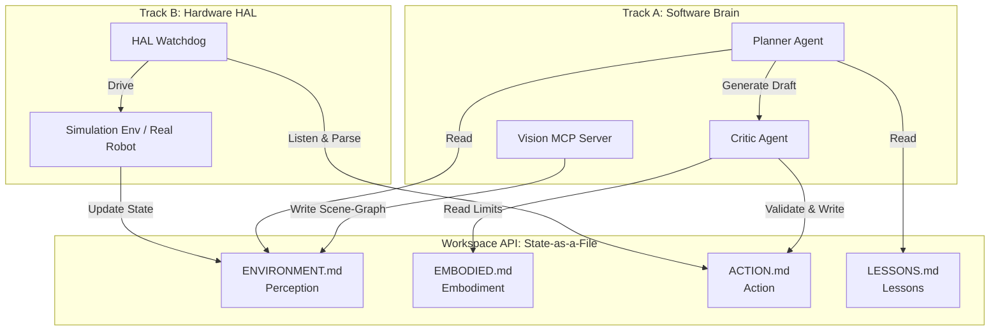

<div align="center">
  
  <h1>OpenEmbodiedAgent (OEA)</h1>
  <p><b>A Consumer-Grade Embodied AI Framework Based on Constraint Solving and Multi-Agent Collaboration</b></p>
  <p>
    <a href="./README.md">English</a> | <a href="./README_zh.md">中文</a>
  </p>
  <p>
    
    
    
  </p>
</div>

🐈 **OpenEmbodiedAgent (OEA)** is an open-source embodied AI framework dedicated to lowering the barrier to entry for robotics. It abandons the dangerous black-box model of "LLMs directly controlling hardware" and pioneers the **"State-as-a-File (Everything is Markdown)"** protocol matrix. Through a **Dual-Track Multi-Agent System** (Software Brain Track A + Hardware HAL Track B), it achieves safe, interpretable, and evolvable robot control.

⚡️ The current version **v0.0.2 (OEA Pioneer Edition)** is built on the ultra-lightweight `nanobot` architecture, aiming to quickly validate OEA's core protocols and workflows through a desktop-level virtual pet and simulation environment.

## 📢 News

- **2026-03-13** 🚀 Released **v0.0.1** — OEA Pioneer Edition released, establishing the core "Everything is Markdown" protocol and validating the software-hardware decoupling and multi-agent validation flow based on a simulation environment.

## Key Features of OEA:

🪶 **Everything is Markdown**: Software and hardware communicate by reading and writing local Markdown files (e.g., `ENVIRONMENT.md`, `ACTION.md`), achieving complete decoupling and extreme transparency.

🧠 **Dual-Track Multi-Agent System**:
- **Track A (Brain)**: Includes Planner and Critic mechanisms. The LLM does not issue commands directly; they must pass the Critic's validation against physical limits (`EMBODIED.md`) before being written to disk.
- **Track B (HAL)**: An independent hardware watchdog (`hal_watchdog.py`) listens for commands and executes them.

🛡️ **Anti-Shitstorm Mechanism**: Strict action validation and a `LESSONS.md` experience repository prevent Agent workflows from spiraling out of control.

🎮 **Simulation Loop**: Built-in lightweight simulation support allows validation of the entire pipeline from natural language commands to physical state changes without real hardware.

## 🏗️ Architecture

The core of OEA is a local Workspace, where software and hardware act as independent daemon processes reading and writing files:



## Table of Contents

- [News](#-news)
- [Key Features](#key-features-of-oea)
- [Architecture](#️-architecture)
- [Quick Start](#-quick-start)
- [Project Structure](#-project-structure)
- [Contribute & Roadmap](#-contribute--roadmap)

## 🚀 Quick Start

### 1. Install Dependencies

```bash
git clone https://github.com/your-repo/OpenEmbodiedAgent.git
cd OpenEmbodiedAgent
pip install -e .
# Install simulation dependencies (e.g., watchdog)
pip install pybullet watchdog
```

### 2. Initialize Workspace

```bash
OEA onboard
```
This will generate the core Markdown protocol files (`EMBODIED.md`, `ENVIRONMENT.md`, etc.) under `~/.OEA/workspace/`.

### 3. Start the System

You need to open two terminals:

**Terminal 1: Start Hardware Watchdog & Simulation (Track B)**
```bash
python hal/hal_watchdog.py
```

**Terminal 2: Start Brain Agent (Track A)**
```bash
OEA agent
```

### 4. Interaction Example

In the `OEA agent` CLI, type:
> "Look at what's on the table, then push that apple onto the floor."

You will see the action executed in the simulation logs in Terminal 1, and receive a completion confirmation from the Agent in Terminal 2.

## 📁 Project Structure

```text
OpenEmbodiedAgent/
├── OEA/                # Track A: Software Brain Core (extended from OEA)
│   ├── agent/              # Agent Logic (Planner, Critic)
│   ├── templates/          # Workspace Markdown Templates
│   └── ...
├── hal/                    # Track B: Hardware HAL & Simulation (New)
│   ├── hal_watchdog.py     # Hardware Watchdog Daemon
│   └── simulation/         # Simulation Environment Code
├── workspace/              # Runtime Workspace (Workspace API)
│   ├── EMBODIED.md         # Robot Embodiment Declaration
│   ├── ENVIRONMENT.md      # Current Environment Scene-Graph
│   ├── ACTION.md           # Pending Action Commands
│   ├── LESSONS.md          # Failure Experience Records
│   └── SKILL.md            # Successful Workflow SOPs
├── docs/                   # Project Documentation
│   ├── PLAN.md             # Detailed Implementation Plan
│   └── PROJ.md             # Project Whitepaper & Architecture
├── README.md               # English Documentation
└── README_zh.md            # Chinese Documentation
```

## 🤝 Contribute & Roadmap

PRs and Issues are welcome! Please refer to `docs/PROJ.md` for detailed architecture design and team division.

**Roadmap** — Pick an item and open a PR!

- [x] **Phase 1 (Current v0.0.1): Desktop Loop & Markdown Protocol Establishment**
  - [x] Extend Workspace templates to include `EMBODIED.md`, `ENVIRONMENT.md`, `ACTION.md`, `LESSONS.md`, `SKILL.md`
  - [x] Modify `OEA/agent/context.py` to forcefully inject `EMBODIED.md` and `ENVIRONMENT.md`
  - [x] Develop `EmbodiedActionTool` to implement Critic validation mechanism and write to `ACTION.md`
  - [x] Configure Heartbeat proactive wake-up mechanism
  - [x] Develop `hal_watchdog.py` to listen to `ACTION.md` and integrate with simulation environment execution
  - [x] Integration & Testing: Run `OEA agent` and `hal_watchdog.py` (with simulation interface), issue commands to validate the loop
- [ ] **Phase 2: Vision Decoupling & Toolchain Merge**
  - [ ] Develop a real MCP Vision Server
  - [ ] Stably reduce multi-modal camera information into a text Scene-Graph and write to `ENVIRONMENT.md`
  - [ ] Activate the `LESSONS.md` mechanism, allowing the model to learn from mistakes
  - [ ] In a ROS2 environment, run through command dispatch and state feedback for the Go2 EDU quadruped chassis
- [ ] **Phase 3: Constraint Solving & High-Order Heterogeneous Collaboration**
  - [ ] Based on Franka and Xlerobot, complete a high-performance C++ ReKep constraint solver
  - [ ] Integrate ROSClaw Bridge
  - [ ] Upgrade scheduling logic to implement time/space locks for concurrent multi-device commands in `ACTION.md`
  - [ ] Achieve the leap from "desktop OEA emotional interaction" to "one car, one arm collaborating to tidy the living room"
  - [ ] Officially launch a community ecosystem market based on `SKILL.md`
